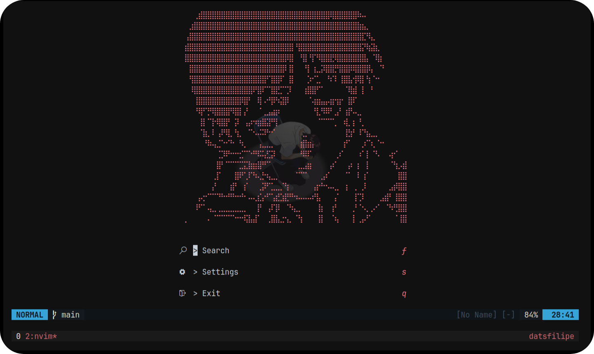
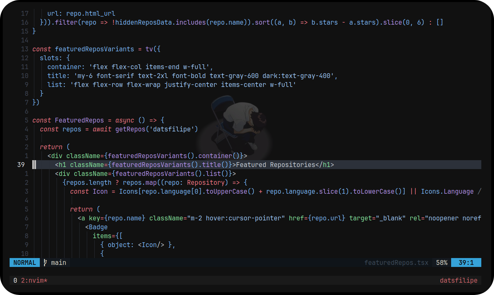

<div align="center">

# DATSNvim [Evangelion Edition]

A minimal configuration for <a target="_blank" href="https://neovim.io">Neovim</a>. Made for my personal use.

<br/>

</img>

<br/>
<br/>

</img>

<br/>
<br/>

</div>

## Installation

1. Install <a href="https://neovim.io" target="_blank">Neovim</a>
2. Install <a href="https://git-scm.com" target="_blank">Git</a>
3. Run the following commands in Linux with bash, zsh or fish (or anything similar):

```bash
git clone https://github.com/datsfilipe/datsnvim.git ~/.config/nvim
nvim .
```

4. It should open `Lazy.nvim` window and install all plugins automatically.