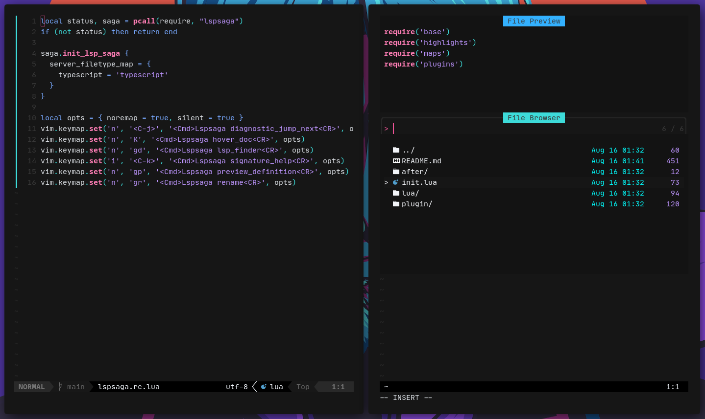

# Datsnvim

### Description

The datsnvim project is a Neovim personal configuration for working with javascript, typescript and React. It also don't have a file tree at the side 😅!

### Installation

```bash
  git clone 'https://github.com/datsfilipe/datsnvim.git' $HOME/.config/nvim

  nvim --headless -c 'autocmd User PackerComplete quitall' -c 'PackerSync'
```

### How it looks like


