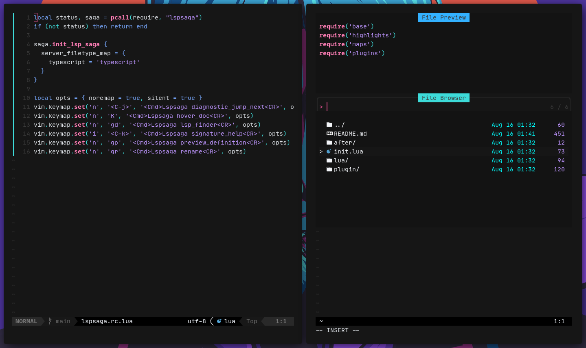

# datsnvim

## description

The datsnvim project is a Neovim personal configuration for working with javascript, typescript and React.

## installation

```bash
  git clone 'https://github.com/datsfilipe/datsnvim.git' $HOME/.config/nvim

  nvim +:PackSync

  # you may need to install some of the plugins manually, check their repository for more info
```

## how it looks like



# credits

Took the major part of the config from [Craftzdog](https://github.com/craftzdog/dotfiles-public) and added [Oxocarbon color scheme](https://github.com/shaunsingh/oxocarbon.nvim).
