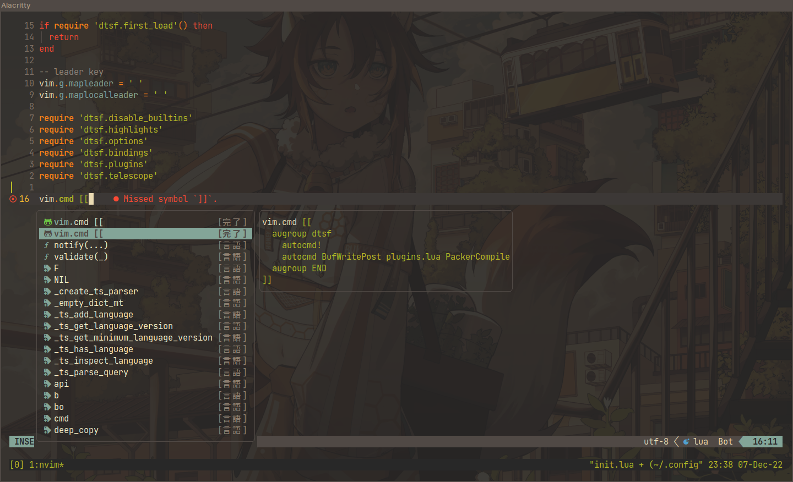

# Datsnvim

### Description

The datsnvim project is a Neovim personal configuration for working with javascript, typescript and React. It also don't have a file tree at the side 😅!

### Installation

```bash
git clone 'https://github.com/datsfilipe/datsnvim.git' $HOME/.config/nvim

nvim .

# you'll be asked to install packer, after saying yes it'll download and close
# then enter the following command

nvim ~/.config/nvim/lua/dtsf/plugins.lua +:w
```

### How it looks like:


