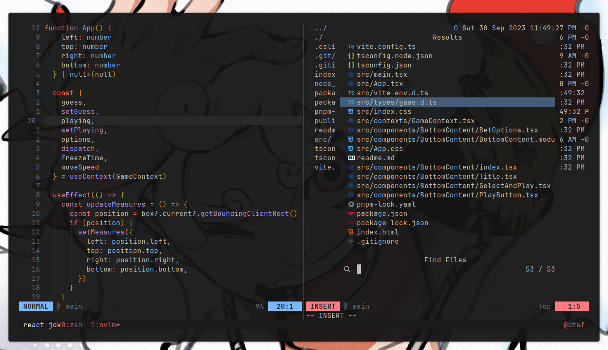

# datsnvim

Well, dat's nvim. But my nvim (config) specifically. So you probably don't want to use it.

If you're still here, be aware: I tried to keep this config as most simple as I could, with fewer plugins as possible.

Adventure yourself as you please.

## Preview

## Installation

Good luck.